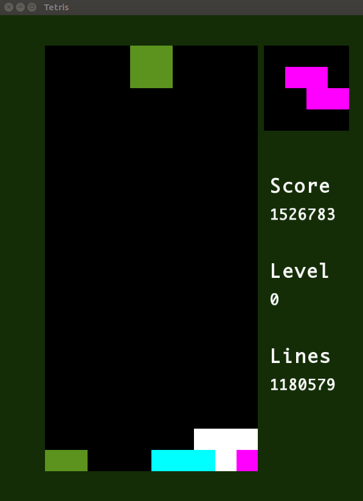

# Learning to play Tetris with the noisy cross entropy method
We use an evolution strategy, the [noisy cross entropy method](resource/cem.pdf), to learn the weights for a linear combination of heuristics to play the game of [Tetris](https://en.wikipedia.org/wiki/Tetris?msclkid=ce9e9043b1da11eca8bd89951e684862).

To compile:
```bash
mkdir build
cd build
cmake ..
make
```

To play the game with some learnt weights (~24h to learn those weights):
```bash
./play -w ../resource/weights.txt
```

you can see the different options with: `./play -h`.

To learn the weights:
```bash
./learn -w ../resource/weights.txt
```

you can see the different options with: `./learn -h`.

